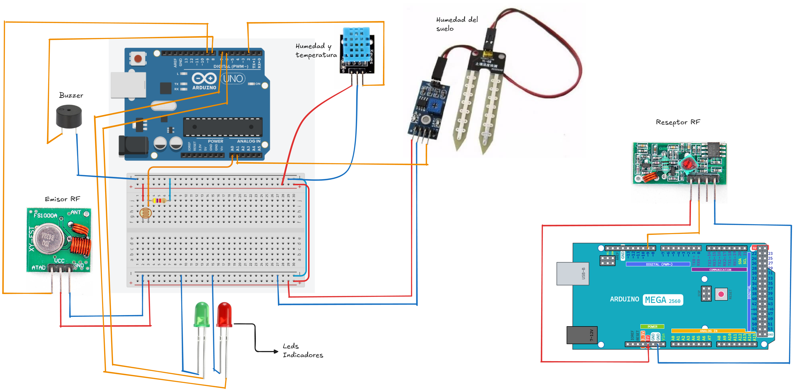

# Proyecto de Seminario de Redes

## Instalacion de dependencias

1. Comando Instalar las dependencias

   ```bash
   npm install
   ```

2. Comando Correr el server

   ```bash
    npm start
   ```

Circuito 


